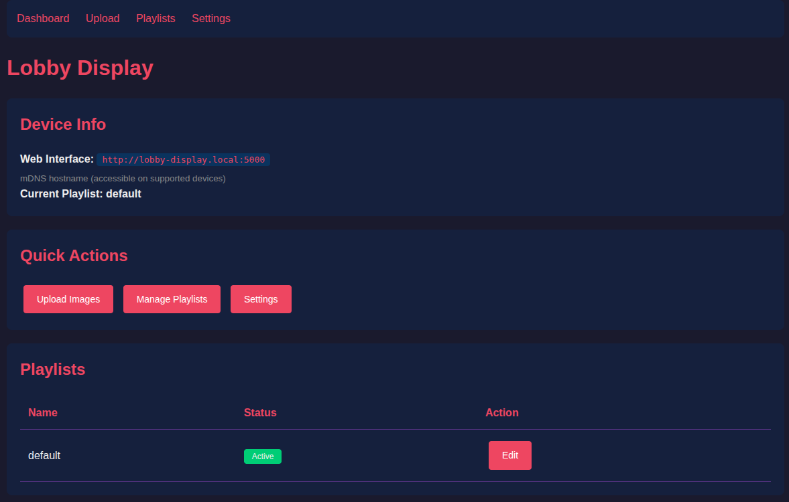

# Lobby Display

Standalone digital signage for Raspberry Pi. No cloud, no subscriptions, no internet required—just a simple web interface to manage rotating images on any HDMI display.

[](LICENSE)
[](https://commputethis.github.io/lobby-display/)
[](https://github.com/commputethis/lobby-display/actions/workflows/build.yml)



## Quick Start

```bash
# Download, install, and run
wget https://github.com/commputethis/lobby-display/releases/latest/download/lobby-display-1.0.0-aarch64.AppImage
chmod +x lobby-display-1.0.0-aarch64.AppImage
./lobby-display-1.0.0-aarch64.AppImage --install
sudo systemctl start lobby-web lobby-display
```

Then open `http://your-pi-ip:5000` in any browser.

## Features

- **Truly Standalone** — Works without internet or external servers
- **Web Management** — Upload images and create playlists from any device
- **Multiple Playlists** — Switch content sets instantly (e.g., "Morning", "Event Mode")
- **mDNS Discovery** — Access by name: `http://lobby-display.local:5000`
- **AppImage Distribution** — Single file, no dependencies to install

## Supported Hardware

| Device | OS |
| -------- | ----- |
| Raspberry Pi 3 | 32-bit or 64-bit |
| Raspberry Pi 4/5 | 64-bit recommended |

## Documentation

- **[Installation Guide](https://commputethis.github.io/lobby-display/INSTALL)** — Detailed setup instructions
- **[Getting Started](https://commputethis.github.io/lobby-display/GETTING_STARTED)** — Using the web interface
- **[Build from Source](https://commputethis.github.io/lobby-display/BUILD)** — Creating your own AppImage
- **[Troubleshooting](https://commputethis.github.io/lobby-display/TROUBLESHOOTING)** — Common issues and fixes

## Project Structure

```text
lobby-display/
├── docs/              # Full documentation (GitHub Pages)
|   ├── images/        # Images
|   └── ...
├── src/               # Source code
│   ├── app.py         # Flask web server
│   ├── display.py     # Slideshow renderer
│   └── ...
├── build.sh           # Build script
└── README.md          # This file
```

## Contributing

Contributions welcome! See [CONTRIBUTING.md](docs/CONTRIBUTING.md) for guidelines.

## License

[MIT License](LICENSE) — Free to use, modify, and distribute.
